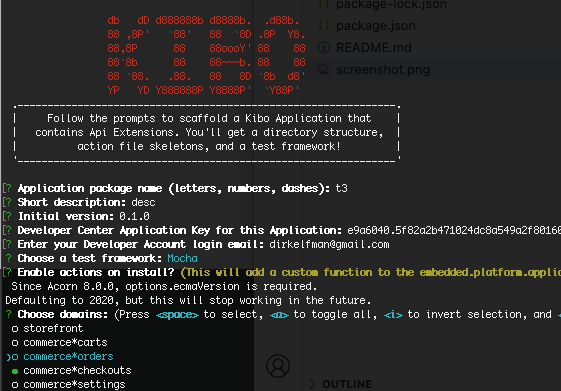

# Mozu Extension generator

Maintainer: [James Zetlen](https://github.com/zetlen)

A Mozu Extension generator for Yeoman that provides boilerplate and structure for writing Mozu Custom Functions against the family of Mozu Extension Actions. It provides documented function stubs, a build process using Grunt and Browserify, remote sync with the Developer Center, and unit tests using Nodeunit or Mocha plus the Mozu Extension Simulator.



## Usage

First, install [Yeoman](http://yeoman.io)'s command line tool if you haven't already!

```bash
npm install -g yo
```

Yeoman looks for globally installed NPM packages that identify themselves as Yeoman generators. 

Make a new directory and `cd` into it:
```
mkdir new-mozu-ext && cd new-mozu-ext
```

Run `yo mozu-extension`:
```
yo mozu-extension
```

## Options

* `--skip-install`
  
  Skips the automatic execution of `npm install` after scaffolding has finished.

* `--skip-prompts`

  Often you may find yourself rerunning the generator in the same directory. Your answers to prompts are saved; if you want to quickly re-run the generator without prompts, use this option. Will not work if you've never run the generator in this directory before.

* `--quick`
  
  Equivalent to `--skip-install --skip-prompts`.

* `--internal`

  Allows integration with non-production Mozu environments. The prompts will include an extra question about which environment to sync with.